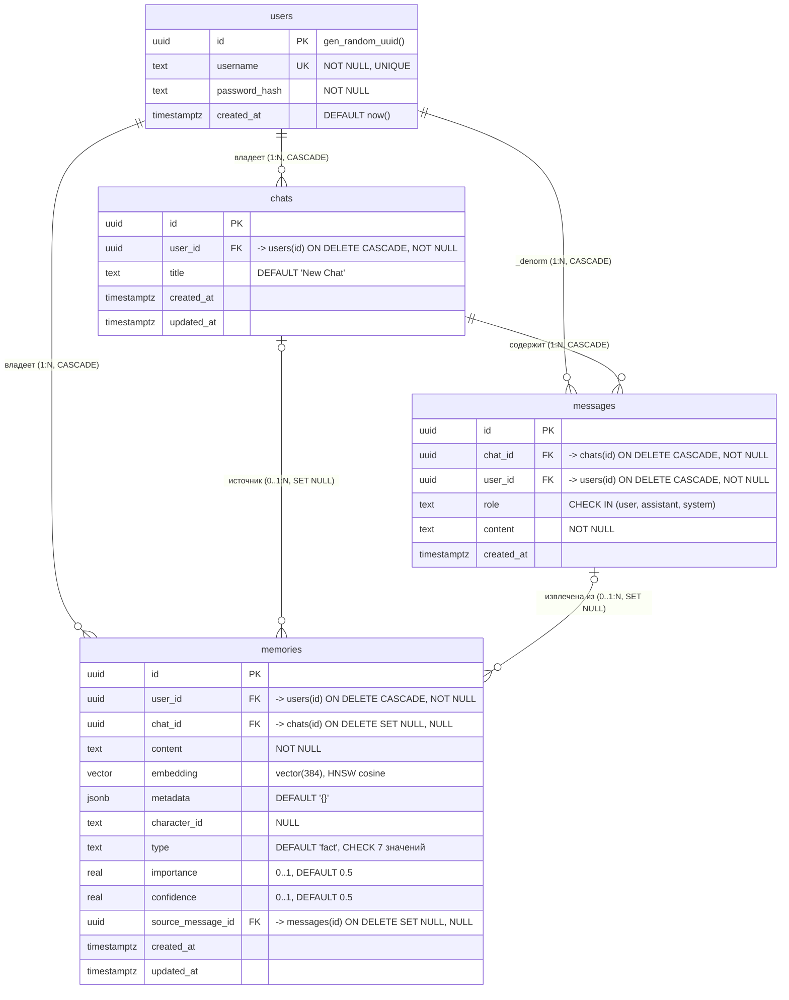

# Database Schema — SillyTavern DB Memory Extension

## Таблицы и ключи

| Таблица | PK | FK | Уникальность / CHECK |
|---|---|---|---|
| `users` | `id UUID` | — | `username UNIQUE NOT NULL` |
| `chats` | `id UUID` | `user_id → users(id)` CASCADE, NOT NULL | — |
| `messages` | `id UUID` | `chat_id → chats(id)` CASCADE; `user_id → users(id)` CASCADE | `role IN ('user','assistant','system')` |
| `memories` | `id UUID` | `user_id → users(id)` CASCADE; `chat_id → chats(id)` SET NULL; `source_message_id → messages(id)` SET NULL | `type IN (fact, preference, event, relationship, character_state, world_information, important_event)`; `importance 0..1`; `confidence 0..1` |

## Типы связей

| Связь | Кардинальность | ON DELETE | Комментарий |
|---|---|---|---|
| users → chats | 1 : N | CASCADE | удалил пользователя — удалились все чаты |
| users → messages | 1 : N | CASCADE | денормализация `user_id` для быстрой проверки изоляции данных |
| chats → messages | 1 : N | CASCADE | сообщения живут внутри чата |
| users → memories | 1 : N | CASCADE | память принадлежит пользователю |
| chats → memories | 0..1 : N | SET NULL | память может быть глобальной (не привязана к чату); чат удалили — память осталась |
| messages → memories | 0..1 : N | SET NULL | `source_message_id` — из какого сообщения извлечён факт; сообщение удалили — память осталась |

## Индексы

- B-Tree: `users(username)`, `chats(user_id)`, `messages(chat_id)`, `messages(user_id)`,
  `memories(user_id)`, `memories(chat_id)`, `memories(character_id)`, `memories(type)`,
  `memories(importance DESC)`, `memories(source_message_id)`
- Векторный: `memories_embedding_hnsw_idx` — **HNSW** на `embedding vector_cosine_ops`
  (семантический поиск по косинусному расстоянию, размерность = 384, должна совпадать с
  `EMBEDDING_DIMENSIONS` бэкенда)
